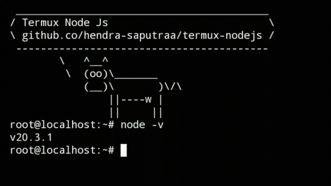

# Termux NodeJs

<p align="left">
  
  
  
  
</p>

Install NodeJs runtime environment on your phone with [Termux](https://termux.com) and also with **custom setup** 🤫

 <br />

> **`termux-nodejs` allows you to install the latest version of node js (node, npm, packages, etc) without any errors or unsupported system.**

### Features

+ Supported for NodeJs 20.3.1 - [latest version](https://nodejs.org/en) for now.
+ Supported for NPM 9.7.2 - [latest version](https://www.npmjs.com/package/npm) for now.
+ Supported for any packages.
+ Running packages without errors or unsupported systems.
+ Database engines are also supported: Prisma, Firebase, Supabase, etc.

### What you need

Make sure you have all of these to avoid errors during the installation process.

+ Termux F-Droid 0.118.0 - [Download Here](https://f-droid.org/en/packages/com.termux/)
+ Ubuntu 22.04 - How to install
+ NVM 0.39.1 - How to install

### How to install

**1.0** - Installing Ubuntu CLI.

```bash
pkg update -y && pkg install wget curl proot tar -y && wget https://raw.githubusercontent.com/AndronixApp/AndronixOrigin/master/Installer/Ubuntu22/ubuntu22.sh -O ubuntu22.sh && chmod +x ubuntu22.sh && bash ubuntu22.sh
```

**1.1** - Installing Curl.

```bash
apt-get update
apt-get install curl -y
```

**1.2** - Installing NVM.

```bash
curl -o- https://raw.githubusercontent.com/nvm-sh/nvm/v0.39.1/install.sh | bash
source ~/.bashrc
```

**1.3** - Now you can check the available versions of Node by running the following command.

```bash
nvm list-remote
```

**1.4** - The version you see is the version you can download, for example i'll use the latest version of Node (20.3.1)

```bash
Output # don't copy this
• • •
        v19.2.0
        v19.3.0
        v19.4.0
        v19.5.0
        v19.6.0
        v19.6.1
        v19.7.0
        v19.8.0
        v19.8.1
        v19.9.0
        v20.0.0
        v20.1.0
        v20.2.0
        v20.3.0
        v20.3.1
```

```bash
# installing Node latest version
nvm install 20.3.1
```

**1.5** - Now you have Node with the version you selected, check the version with:

```bash
node -v
```

**1.6** - NPM is also installed but not with the latest version, check the current version:

```bash
npm -v
```

**1.7** - Now let's install the latest version of NPM globally (9.7.2)

```bash
npm install -g npm@9.7.2
```

**1.8** - You are all set now, Node and NPM are installed and this is optional if you want to use Yarn, follow these steps.

```bash
apt-get install gnupg gnupg1 gnupg2 -y
curl -sS https://dl.yarnpkg.com/debian/pubkey.gpg | apt-key add -
echo "deb https://dl.yarnpkg.com/debian/ stable main" | tee /etc/apt/sources.list.d/yarn.list
```

```bash
apt-get update && apt-get install yarn
```

**DONE** - Happy Hacking!

### Previews

|Node & NPM|
|--|
||

### FYI
- Using `termux-nodejs` highly recommended for purposes like building websites or apps.
- I suggest you to use the stable version of Node to avoid errors.
- The Ubuntu OS that you are using right now is Linux Distribution by [ANDRONIX](https://andronix.app/)
- Thanks for using my setup! Highly Appreciate It.
